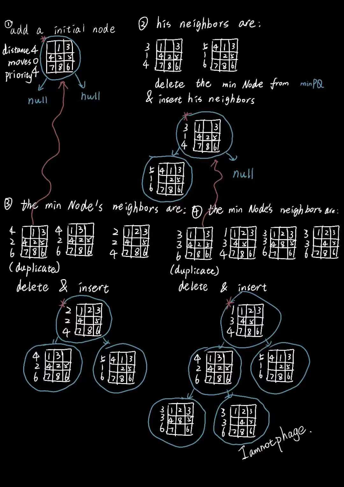

# 8puzzle

* 100/100

核心是优先队列，需要用到A*算法，但是给出的文档也有提及思路，所以似乎并没有那么硬核的使用。

关于算法的思路如下：

个人遇到的问题：

* Board类的isGoal()和equals()一定要极其认真写
* Board类的twin()一定要理解到位
* 写完Board类一定要进行测试
* Solver类中用到优先队列的插入时，一定要检查邻居是否重复，否则会堆溢出。
* Solver类的solution()从上图的草稿看，不够明显是如何获取的。但是一定要从最终的goal的棋盘回溯到最开始的棋盘，(goal.pre)类似这样。为什么？如果某个结点的邻居有两个棋盘的priority一样小，只是利用每次删除的minNode来加入到solution里，会导致solution的结点顺序错误，临近的两结点不是邻居。所以用pre来保证solution输出的序列一定是相邻的。（eg. 123 076 548）
* 关于内存，Solver类中的MinPQ最好是放在构造函数内部，这样执行完之后会自动清除，从而不会导致内存超出要求。

`To solve the puzzle from a given search node on the priority queue, the total number of moves we need to make (including those already made) is at least its priority, using either the Hamming or Manhattan priority function. Why? Consequently, when the goal board is dequeued, we have discovered not only a sequence of moves from the initial board to the goal board, but one that makes the fewest moves. (Challenge for the mathematically inclined: prove this fact.)`

`Proof: 假设优先队列的最小结点是第N个结点(distance, move, priority)，它的邻居只可能有两种情况（从距离上看）：比第N个结点距离大1 或 比第N个结点距离小1。而作为邻居结点，它们的move只会递增1。当删除第N个结点时，优先队列的最小结点将会是第N个结点邻居的距离较小的那个 (distance-1, move+1, priority) 对于任意N成立，所以最终distance=0时，move=priority，Q.E.D.`