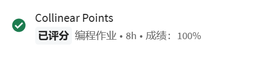

# collinear

* 100/100

核心是排序。

自己写了两个版本都100/100通过线上平台，大同小异；

一个自定义链表实现，一个Stack实现（这个简单一点, 更推荐）

个人遇到的问题：

* 构造器传入的points不能改变，否则部分样例不通过
* 检查points中元素是否重复或者null，如果调用slopeTo()必须保证两者都不是null，否则会错误抛出异常
* 使用ArrayList，LinkedList等java.util封装的数据结构会出现超时（但是自定义的链表和Stack不会）
* FastCollinearPoints类里面，去掉重复线段的处理要非常小心，详见代码
* 样例有多次调用同一个函数，请保证每次调用返回结果一样(eg.不能直接把栈弹光，后续再调用结果就不一样了)