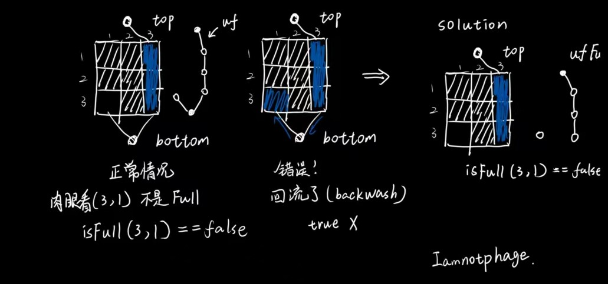

# percolation

* 100/100 

  
有点小问题，后续再整改 (2023-10-11 19:33更新)

核心就是Union Find的使用。

对于计算概率p，80分通过基本上没问题。

但是在线平台有一些细节需要注意：

* Backwash现象
* 多次调用PercolationStats的函数确保结果一致

Backwash现象主要围绕isFull()的判断，如果按照幻灯片里面的两个虚拟节点来判断是否percolate，确实很方便，但是如果判断isFull,就会出现Backwash（回流）的现象。

主要表现如下图：

所以最好是弄两个uf对象，一个包含两个虚拟结点，一个只包含一个top的虚拟结点。