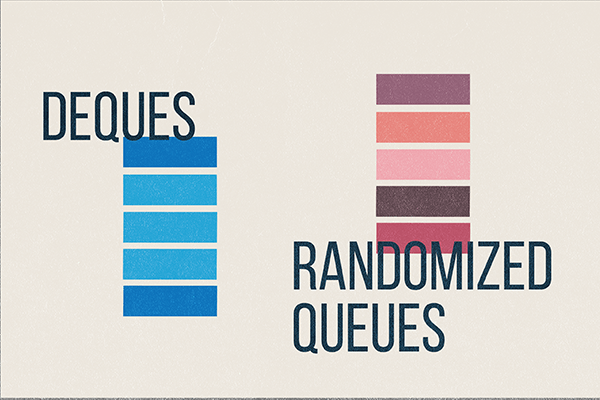

# queue


* 100/100


核心就是操作链表。

好像没啥大问题，轻轻松松。

`Deque.java`:

```Java
import edu.princeton.cs.algs4.StdOut;

  

import java.util.Iterator;

import java.util.NoSuchElementException;

  

public class Deque<Item> implements Iterable<Item> { // object overhead 16 Byte

    // at most 48n + 192 bytes of memory

    private int size; // 4 Byte

  

    private Node first; // 8 Byte ref

    private Node last; // 8 Byte ref

  
  

    private class Node{ // 16 Byte overhead

        Item item; // 8 Byte ref

        Node pre; // 8 Byte ref

        Node next; // 8 Byte ref

    }

  
  

    // construct an empty deque

    public Deque(){

        size = 0;

        first = null;

        last = null;

    }

  
  

    // is the deque empty?

    public boolean isEmpty() {

        return size == 0;

    }

  

    // return the number of items on the deque

    public int size(){return size;}

  

    // add the item to the front

    public void addFirst(Item item){

        if(item==null){

            throw new IllegalArgumentException();

        }

        Node oldFirst = first;

        first = new Node();

        first.item = item;

        first.next = oldFirst;

        first.pre = null;

  

        if(isEmpty()){

            last = first;

        }else{

            oldFirst.pre = first;

        }

        size++;

    }

  
  

    // add the item to the back

    public void addLast(Item item){

        if(item==null){

            throw new IllegalArgumentException();

        }

        Node oldLast = last;

        last = new Node();

        last.item = item;

        last.pre = oldLast;

        last.next = null;

  

        if(isEmpty()){

            first = last;

        }else{

            oldLast.next = last;

        }

        size++;

    }

  
  

    // remove and return the item from the front

    public Item removeFirst(){

        if(isEmpty()){

            throw new NoSuchElementException();

        }

        Item item = first.item;

        first = first.next;

        size--; // must decrease first

  

        if(isEmpty()){

            last = null;

        }else{

            first.pre = null;

        }

        return item;

    }

  
  

    // remove and return the item from the back

    public Item removeLast(){

        if(isEmpty()){

            throw new NoSuchElementException();

        }

        Item item = last.item;

        last = last.pre;

        size--;

  

        if(isEmpty()){

            first = null;

        }else{

            last.next = null;

        }

        return item;

    }

  
  

    // return an iterator over items in order from front to back

    public Iterator<Item> iterator(){

        return new DequeIterator();

    }

  

    private class DequeIterator implements Iterator<Item> {

        private Node current = first;

  

        public boolean hasNext() {

            return current != null;

        }

  

        public Item next() {

            if(!hasNext()){

                throw new NoSuchElementException();

            }

            Item item = current.item;

            current = current.next;

            return item;

        }

  

        public void remove() {

            /* not supported */

            throw new UnsupportedOperationException();

        }

    }

  
  

    // unit testing (required)

    public static void main(String[] args){

        Deque<Integer> dq = new Deque<Integer>();

        for(int i=0;i<5;i++){

            dq.addFirst(i);

        }

        for(int i=5;i<10;i++){

            dq.addLast(i);

        }

        StdOut.println(dq.size());

        StdOut.println(dq.removeFirst());

        StdOut.println(dq.size());

        StdOut.println(dq.removeLast());

        StdOut.println(dq.size());

        Iterator<Integer> it = dq.iterator();

        while(it.hasNext()){

            StdOut.println(it.next());

        }

    }

}
```

`RandomizedQueue.java`:

```Java
import edu.princeton.cs.algs4.StdOut;

import edu.princeton.cs.algs4.StdRandom;

  

import java.util.Iterator;

import java.util.NoSuchElementException;

  

public class RandomizedQueue<Item> implements Iterable<Item> {

  

    private Item[] randomizedQueue;

    private int n;

  

    // construct an empty randomized queue

    public RandomizedQueue(){

        n = 0;

        randomizedQueue = (Item[]) new Object[1];

    }

  

    private void resize(int newSize){

//        if(newSize <= 0){

//            throw new IllegalArgumentException();

//        }

        Item[] copy = (Item[]) new Object[newSize];

        for(int i = 0; i < n; i++){

            copy[i] = randomizedQueue[i];

        }

        randomizedQueue = copy;

    }

    // is the randomized queue empty?

    public boolean isEmpty(){return n == 0;}

  

    // return the number of items on the randomized queue

    public int size(){return n;}

  

    // add the item

    public void enqueue(Item item){

        if(item == null){

            throw new IllegalArgumentException();

        }

        if(n == randomizedQueue.length){

            // grow array: twice the size

            resize(2 * randomizedQueue.length);

        }

        randomizedQueue[n++] = item;

    }

  

    // remove and return a random item

    public Item dequeue(){

        if(isEmpty()){

            throw new NoSuchElementException();

        }

        // random

        int randNum = StdRandom.uniformInt(n); // [0,n)

        Item item = randomizedQueue[randNum];

  

        // 每次出队列都是等概率(uniformly random)

        // 就不需要线性移动randNum之后的所有元素

        if(randNum != n - 1){

            randomizedQueue[randNum] = randomizedQueue[n - 1];

        }

        randomizedQueue[n - 1] = null;

        n--;

  

        if(n > 0 && n == randomizedQueue.length / 4){

            resize(randomizedQueue.length / 2);

        }

  

        return item;

    }

  

    // return a random item (but do not remove it)

    public Item sample(){

        if(isEmpty()){

            throw new NoSuchElementException();

        }

        return randomizedQueue[StdRandom.uniformInt(n)];

    }

  

    // return an independent iterator over items in random order

    public Iterator<Item> iterator(){

        return new RandomizedQueueIterator();

    }

  

    private class RandomizedQueueIterator implements Iterator<Item> {

        private int index;

        private Item[] items;

  

        public RandomizedQueueIterator(){

            index = 0;

            items = (Item[]) new Object[n];

            for(int i=0;i<n;i++){

                items[i] = randomizedQueue[i];

            }

            StdRandom.shuffle(items); // in random order

        }

  

        public boolean hasNext() {

            return index < n;

        }

  

        public Item next() {

            if(!hasNext()){

                throw new NoSuchElementException();

            }

            return items[index++];

        }

  

        public void remove() {

            throw new UnsupportedOperationException();

        }

    }

  

    // unit testing (required)

    public static void main(String[] args){

        RandomizedQueue<Integer> rq = new RandomizedQueue<Integer>();

        StdOut.println(rq.size());

        for(int i=0 ;i < 10; i++){

            rq.enqueue(i);

        }

        StdOut.println(rq.size());

        StdOut.println(rq.dequeue());

        StdOut.println("new size: " + rq.size());

        StdOut.println(rq.sample());

        Iterator<Integer> it = rq.iterator();

        while(it.hasNext()){

            StdOut.println(it.next());

        }

    }

}
```

`Permutation.java`:

```Java
import edu.princeton.cs.algs4.StdIn;

import edu.princeton.cs.algs4.StdOut;

  

public class Permutation {

    public static void main(String[] args) {

        int k = Integer.parseInt(args[0]);

        RandomizedQueue<String> rq = new RandomizedQueue<String>();

  

        // input n strings, where n is not given

        String item;

        while (!StdIn.isEmpty()) {

            item = StdIn.readString();

            rq.enqueue(item);

        }

  

        // iterators have StdRandom.shuffle()

        for (String s : rq) {

            if (k == 0) {

                break;

            }

            StdOut.println(s);

            k--;

        }

    }

}
```