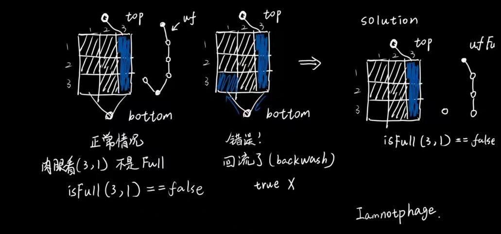
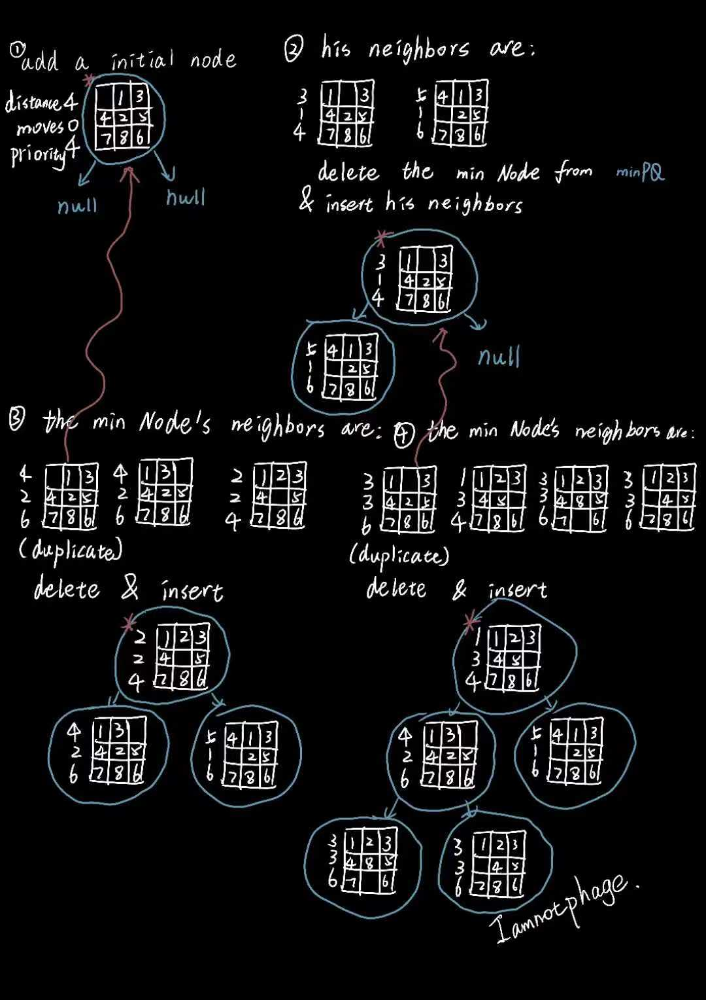
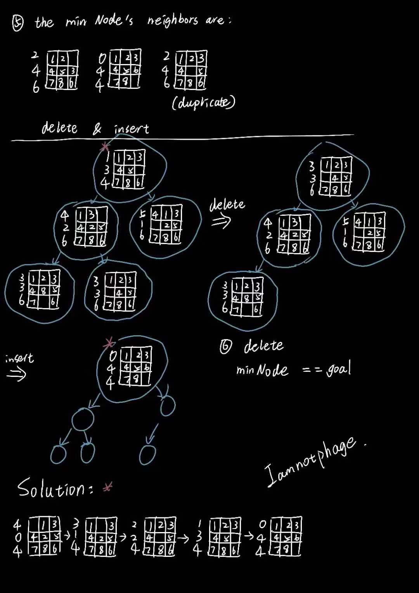

# Algs4-Labs
My personal solutions for algs4 labs💀

- [Algs4-Labs](#algs4-labs)
- [Websites](#websites)
- [hello](#hello)
- [percolation](#percolation)
- [queues](#queues)
- [collinear](#collinear)
- [8puzzle](#8puzzle)

# Websites

官网和coursera上有很多资料，也有实验的在线评测平台。

课程官网：https://algs4.cs.princeton.edu/home/

Coursera官网：https://www.coursera.org/

部分我觉得有意思的课后练习题：[Click Here](/interestingAssignments/)

# hello

主要配置环境，测试algs4.jar是否能正常编译运行

说实话，这个是最搞的。

Windows平台下，最简单的方法如下：(摸索了很久)

[点击这个网址](https://lift.cs.princeton.edu/java/windows/)

然后下载`lift-java-installer.exe`这个一键安装的内容包含：

* IntelliJ
* Git
* 还有一些配置文件

然后运行，它会覆盖classpath还有原先的JAVA path。如果你喜欢挑战自我可以试试手动配置

(安装JDK，添加JAVAPATH，下载algs4.jar，添加到classpath，再安装git，再把algs4.jar添加到git的path，然后用IDE导入algs4.jar包)。不推荐💀

上述内容是可选的，安装了Git或者IntelliJ可以不用勾选。

然后下载algs4.jar包

接下来在IDE里面导入包 (Bing一下，你就知道)

能够在Git Bash中使用

`javac-algs4`

`java-algs4`

这两个命令，就证明成功

# percolation

* 100/100 
  
有点小问题，后续再整改 (2023-10-11 19:33更新)

核心就是Union Find的使用。

对于计算概率p，80分通过基本上没问题。

但是在线平台有一些细节需要注意：

* Backwash现象
* 多次调用PercolationStats的函数确保结果一致

Backwash现象主要围绕isFull()的判断，如果按照幻灯片里面的两个虚拟节点来判断是否percolate，确实很方便，但是如果判断isFull,就会出现Backwash（回流）的现象。

主要表现如下图：

所以最好是弄两个uf对象，一个包含两个虚拟结点，一个只包含一个top的虚拟结点。

# queues

* 100/100

核心就是操作链表。

好像没啥大问题。

# collinear

* 100/100

核心是排序。

自己写了两个版本都100/100通过线上平台，大同小异；

一个自定义链表实现，一个Stack实现（这个简单一点, 更推荐）

个人遇到的问题：

* 构造器传入的points不能改变，否则部分样例不通过
* 检查points中元素是否重复或者null，如果调用slopeTo()必须保证两者都不是null，否则会错误抛出异常
* 使用ArrayList，LinkedList等java.util封装的数据结构会出现超时（但是自定义的链表和Stack不会）
* FastCollinearPoints类里面，去掉重复线段的处理要非常小心，详见代码
* 样例有多次调用同一个函数，请保证每次调用返回结果一样(eg.不能直接把栈弹光，后续再调用结果就不一样了)

# 8puzzle

* 100/100
  
核心是优先队列，需要用到A*算法，但是给出的文档也有提及思路，所以似乎并没有那么硬核的使用。

关于算法的思路如下：

个人遇到的问题：

* Board类的isGoal()和equals()一定要极其认真写
* Board类的twin()一定要理解到位
* 写完Board类一定要进行测试
* Solver类中用到优先队列的插入时，一定要检查邻居是否重复，否则会堆溢出。
* Solver类的solution()从上图的草稿看，不够明显是如何获取的。但是一定要从最终的goal的棋盘回溯到最开始的棋盘，(goal.pre)类似这样。为什么？如果某个结点的邻居有两个棋盘的priority一样小，只是利用每次删除的minNode来加入到solution里，会导致solution的结点顺序错误，临近的两结点不是邻居。所以用pre来保证solution输出的序列一定是相邻的。（eg. 123 076 548）
* 关于内存，Solver类中的MinPQ最好是放在构造函数内部，这样执行完之后会自动清除，从而不会导致内存超出要求。

`To solve the puzzle from a given search node on the priority queue, the total number of moves we need to make (including those already made) is at least its priority, using either the Hamming or Manhattan priority function. Why? Consequently, when the goal board is dequeued, we have discovered not only a sequence of moves from the initial board to the goal board, but one that makes the fewest moves. (Challenge for the mathematically inclined: prove this fact.)`

`Proof: 假设优先队列的最小结点是第N个结点(distance, move, priority)，它的邻居只可能有两种情况（从距离上看）：比第N个结点距离大1 或 比第N个结点距离小1。而作为邻居结点，它们的move只会递增1。当删除第N个结点时，优先队列的最小结点将会是第N个结点邻居的距离较小的那个 (distance-1, move+1, priority) 对于任意N成立，所以最终distance=0时，move=priority，Q.E.D.`