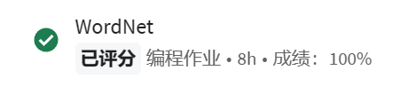

# wordnet

* 100/100



Part II的难度直接飙升一个台阶。

**Tips**:

* synset和hypernym关系要捋清楚。
* WordNet的数据结构一定要构思清楚，id和synset是多对多的映射关系，一个id可能有多个noun，一个noun可能有多个id (数据结构详见下文)。
* 读取synset.txt和hypernyms.txt文件的方法：用algs4.In里面的in.readLine()逐行读取，用String类的split对字段分割
* 如何判断是否是DAG（即是否有环）：用ToplogicalSort或者DirectedCycle类的方法`hasCycle()`。
* TopologicalSort如何实现：有向图DFS，结点压栈得到reversePostOrder。反过来了就是Topological Sort的序列。
* 如何寻找公共祖先：对于两个结点v和w，各自用BFS, v先BFS，过程中记录遍历的结点x对v的距离；w再BFS，每次将队列首元素出列时，查看是否已经有对v距离的记录，如果有，更新minDistance。总之就是两次BFS的过程。
* 拓展：有向图的强连通分量求法：Kosaraju-Sharir算法


```Java
private final SAP sap;  
private final ArrayList<String> synList; // 同位词集添加到这里 索引就是id  
  
private final HashMap<String, List<Integer>> synsetToIdMap; // 一个id对应多个名词, 所以反过来一个名词对应部分id
```